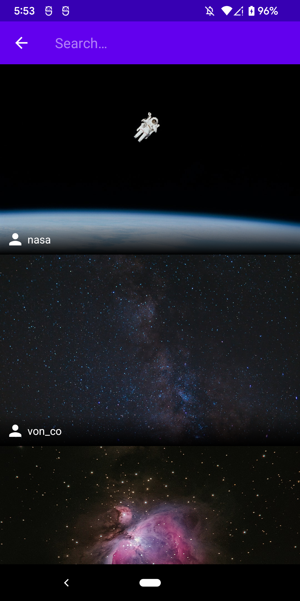
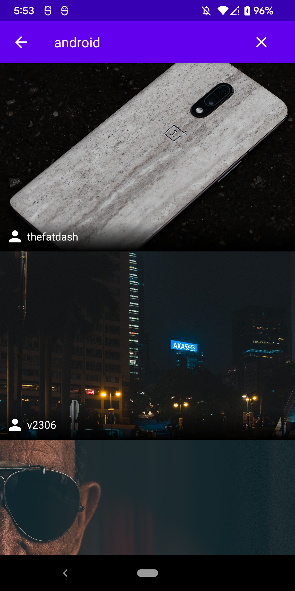
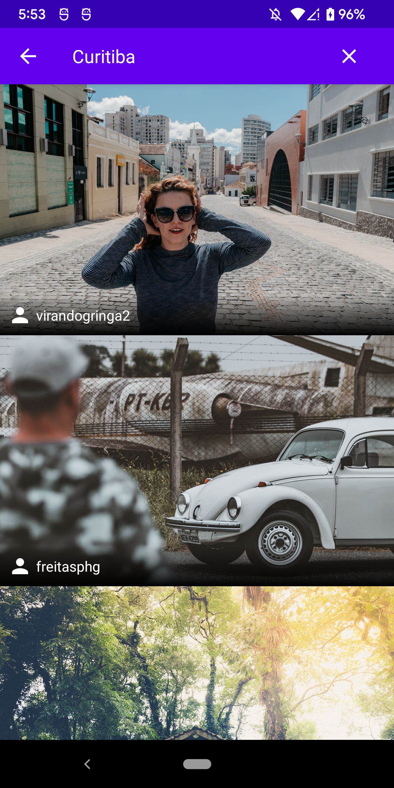
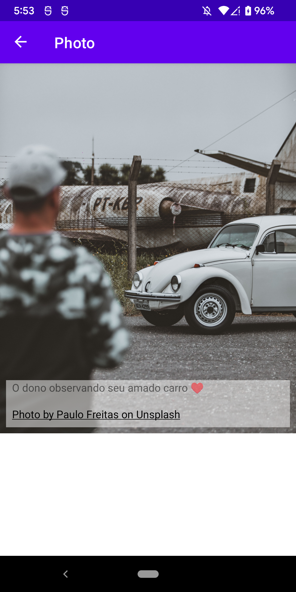
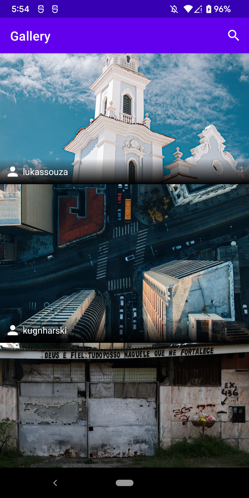

# ImageFinder

### **Overview - About this project**
This is a simple Image Finder App using Clean Architecture (MVVM, Use Cases)  and also Jetpack Compose to show a modern **UI/UX**

For this API is used:
- unsplash API: 
https://unsplash.com/developers

### 📷 How is this App
</img>
</img>
</img>
</img>
</img>

### 💻Technology
- [Kotlin](https://kotlinlang.org/)
- [Jetpack Compose](https://developer.android.com/jetpack/compose)
- [Dagger Hilt](https://dagger.dev/hilt/)
 
### Donation
If this project help you reduce time to develop, you can buy me a cup of coffee :) 

